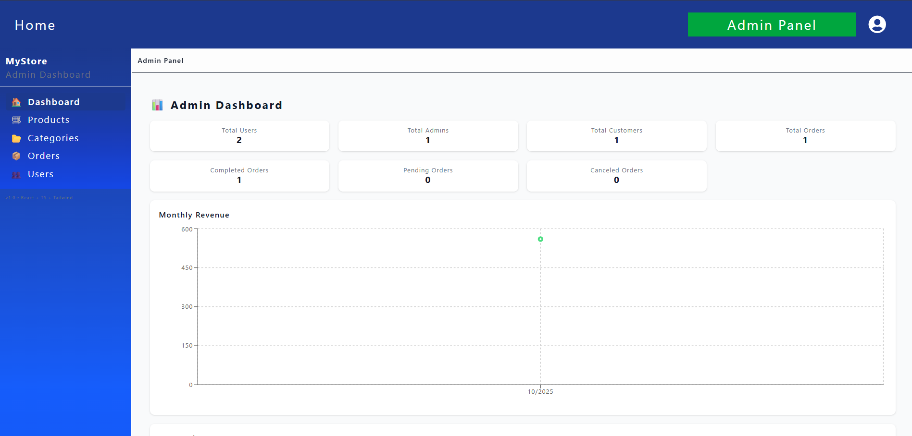
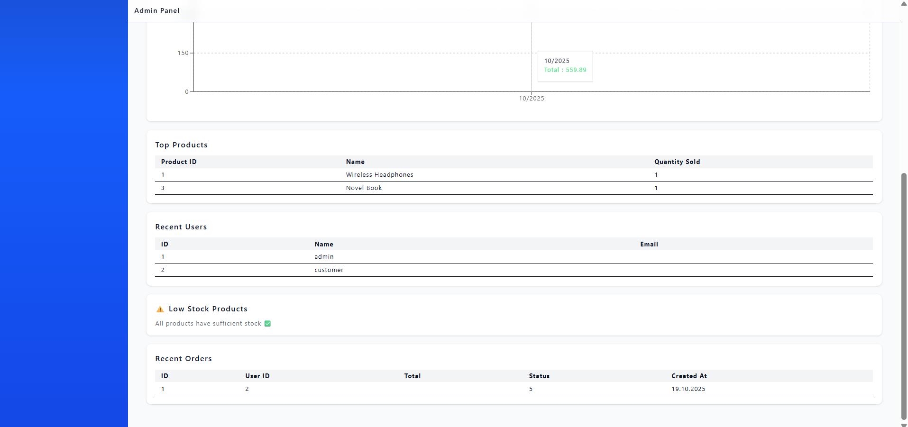
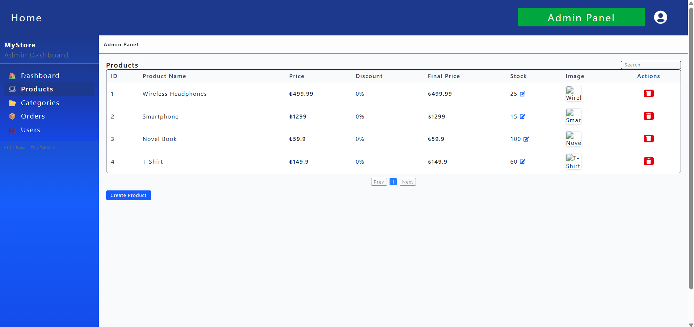
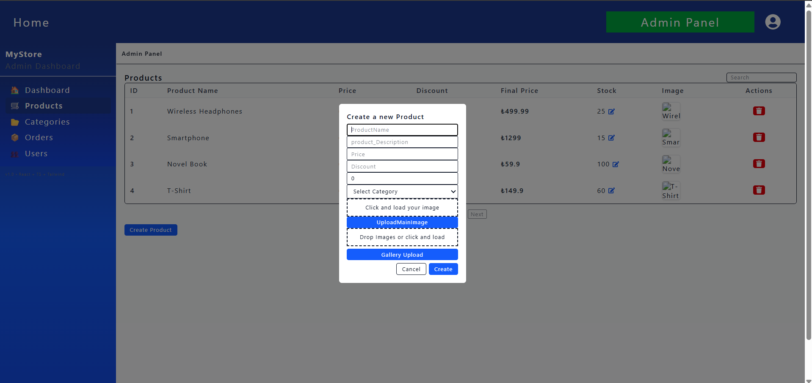
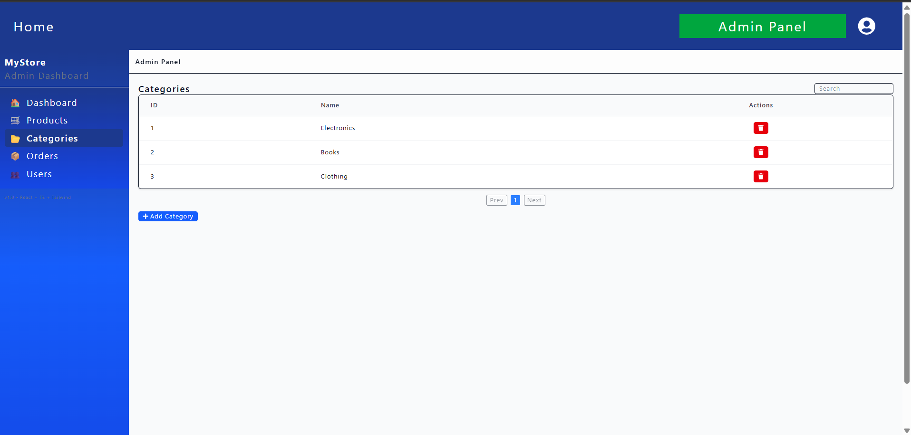
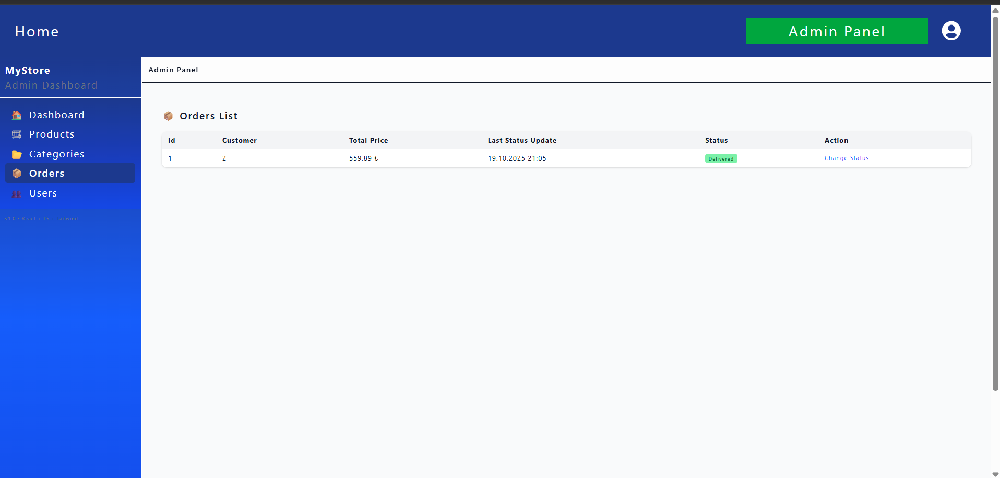
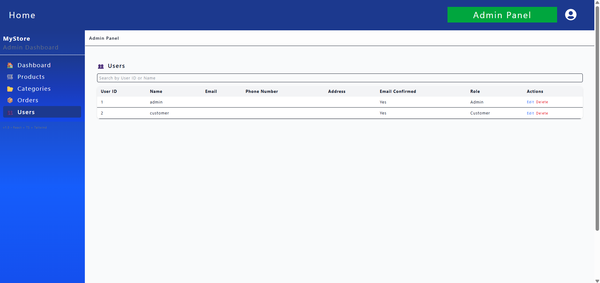
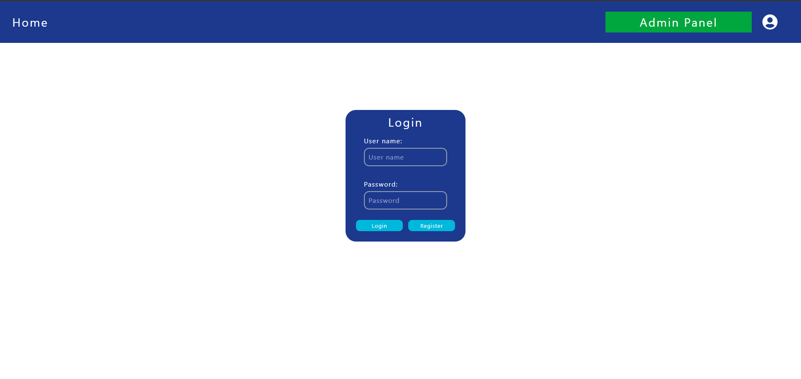

# E-Commerce API Demo with Admin Panel

Full-stack e-commerce backend and admin panel solution built with ASP.NET Core and React.  
Designed for rapid integration, this demo includes 23 working endpoints, user/product/order management, dashboard analytics, and demo payment integration.

---

## Features

- **User Management:** roles, soft delete  
- **Product & Category Management:** add/update/delete products & categories  
- **Order Management:** track orders, change status (demo mode)  
- **Dashboard Analytics:** total users, total orders, revenue charts, top products, low stock  
- **Payment Integration:** demo mode  
- **Technologies:** React + TypeScript (Frontend), ASP.NET Core 8 + EF Core (Backend)

---

## Demo Mode

> Note: For safety, some endpoints like POST/PUT/PATCH are disabled. GET endpoints and dashboard are fully functional.

---

## Installation

### Backend
```bash
cd server
dotnet restore
dotnet run
```
Uses SQLite/MySQL (see appsettings.json)
### Admin Panel
```bash
cd admin-panel
npm install
npm run dev
```

Ensure environment variable points to backend:

VITE_API_URL=https://your-backend-url.com


ScreenShots:
Dashboard:



Products:



Categories:


Orders:


Users:

Login:


Notes:
Backend and frontend files are ready-to-deploy

Payment integration works in demo/test mode

Designed for agencies or developers to integrate quickly